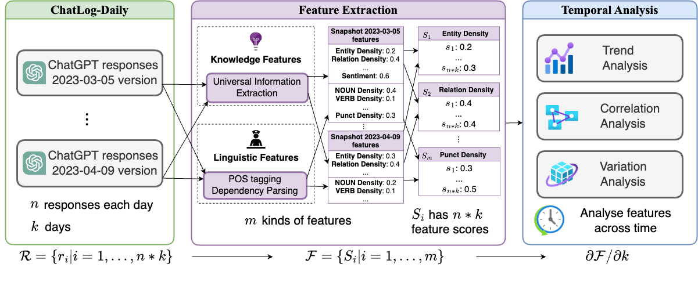

# ⏳ ChatLog: Recording and Analysing ChatGPT Across Time

# Overview
This repository stores data and code for the paper `ChatLog: Recording and Analysing ChatGPT Across Time` [[abs](https://arxiv.org/abs/2304.14106)][[pdf](https://arxiv.org/pdf/2304.14106.pdf)].

While there are abundant researches about evaluating ChatGPT on natural language understanding and generation tasks, few studies have investigated how ChatGPT's behavior changes over time. In this paper, we collect a coarse-to-fine temporal dataset called ChatLog, consisting of two parts that update monthly and daily: **ChatLog-Monthly** is a dataset of **38,730** question-answer pairs collected every month including questions from both the reasoning and classification tasks. **ChatLog-Daily**, on the other hand, consists of ChatGPT's responses to **1000** identical questions for long-form generation **every day**. We conduct comprehensive automatic and human evaluation to provide the evidence for the existence of ChatGPT evolving patterns. We further analyze the unchanged characteristics of ChatGPT over time by extracting its knowledge and linguistic features. We find some stable features to improve the robustness of a RoBERTa-based detector on new versions of ChatGPT. We will continuously maintain our project on GitHub.




# Data

We release our data at [tsinghua cloud](https://cloud.tsinghua.edu.cn/d/733684efbec84cbb8c52/).

Now the category is as following, you can download them by clicking the link:

- ChatLog-Monthly
  -  [202303.zip](https://cloud.tsinghua.edu.cn/d/733684efbec84cbb8c52/files/?p=%2FChatLog-Monthly%2F202303.zip&dl=1)
  -  [202304.zip](https://cloud.tsinghua.edu.cn/d/733684efbec84cbb8c52/files/?p=%2FChatLog-Monthly%2F202304.zip&dl=1)
- ChatLog-Daily
  - api
    - [everyday_20230305-20230409.zip](https://cloud.tsinghua.edu.cn/d/733684efbec84cbb8c52/files/?p=%2FChatLog-Daily%2Fapi%2Feveryday_20230305-20230409.zip&dl=1)
    - [everyday_20230410-20230508.zip](https://cloud.tsinghua.edu.cn/d/733684efbec84cbb8c52/files/?p=%2FChatLog-Daily%2Fapi%2Feveryday_20230410-20230508.zip&dl=1)
  - open
    - [before0301.zip](https://cloud.tsinghua.edu.cn/d/733684efbec84cbb8c52/files/?p=%2FChatLog-Daily%2Fopen%2Fbefore0301.zip&dl=1)
  - processed_csv
    - [avg_HC3_all_pearson_corr_feats.csv](https://cloud.tsinghua.edu.cn/d/733684efbec84cbb8c52/files/?p=%2FChatLog-Daily%2Fprocessed_csv%2Favg_HC3_all_pearson_corr_feats.csv&dl=1)
    - [avg_HC3_knowledge_pearson_corr_feats.csv](https://cloud.tsinghua.edu.cn/d/733684efbec84cbb8c52/files/?p=%2FChatLog-Daily%2Fprocessed_csv%2Favg_HC3_knowledge_pearson_corr_feats.csv&dl=1)

Every `zip` file contains some `jsonl` files and each json object is as the format:

| column name:  | id       | source_type                                      | source_dataset                    | source_task                                    | q                                                          | a                    | language         | chat_date                       | time                                               |
| ------------- | -------- | ------------------------------------------------ | --------------------------------- | ---------------------------------------------- | ---------------------------------------------------------- | -------------------- | ---------------- | ------------------------------- | -------------------------------------------------- |
| introduction: | id       | type of the source: from open-access dataset/api | dataset of the question come from | specific task name，such as sentiment analysis | question                                                   | response of  ChatGPT | language         | The time that ChatGPT responses | The time that the data is stored into our database |
| example       | 'id': 60 | 'source_type': 'open'                            | 'source_dataset': 'ChatTrans'     | 'source_task': 'translation'                   | 'q': 'translate this sentence into Chinese: Good morning', | 'a': '早上好',       | 'language': 'zh' | 'chat_date': '2023-03-03',      | 'time': '2023-03-04 09:58:09',                     |

The ChatLog-Monthly and ChatLog-Daily will be continuously updated.

# Analysis Code

For processsing data from 20230305 to 20230409, please use v1 version's shells.
For processsing data after 20230410, please use v2 version's shells.

1. For extracting all the knowledge and linguistic features, run:

```
sh shells/process_new_data_v1.sh
```

2. For analyzing features and calculating variation, run:

```
sh shells/analyse_var_and_classify_across_time_v1.sh
```

3. Use LightGBM that ensembles the features with RoBERTa to train a robust ChatGPT detector, run:

```
sh shells/lgb_train_v1.sh
```

4. For trend and correlation analysis, first dumping knowledge features into `avg_HC3_knowledge_pearson_corr_feats.csv`

```
sh shells/draw_knowledge_feats_v1.sh
```

5. Then dump other linguistic features into `avg_HC3_all_pearson_corr_feats.csv`

```
sh shells/draw_eval_corr_v1.sh
```

6. Finally, we can draw heatmaps and lineplots for trend and correlation analysis:

   - Put the dumped  `avg_HC3_knowledge_pearson_corr_feats.csv` and  `avg_HC3_all_pearson_corr_feats.csv` under the `./shells` folder
   - Then use `./shells/knowledge_analysis.ipynb` and `./shells/temporal_analysis.ipynb` to draw every figure.

   
# Citation
If you find our work useful, please cite:

```
@article{tu2023chatlog,
  title={ChatLog: Recording and Analyzing ChatGPT Across Time},
  author={Tu, Shangqing and Li, Chunyang and Yu, Jifan and Wang, Xiaozhi and Hou, Lei and Li, Juanzi},
  journal={arXiv preprint arXiv:2304.14106},
  year={2023}
}
```
